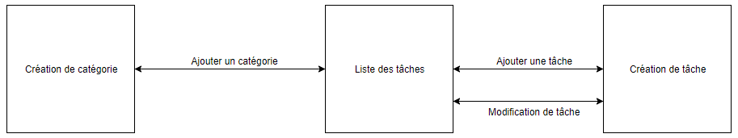

# AdvancedTodo

## Introduction

Notre projet était de créer une application qui permettait l’ajout de listes de choses à faire, avec des rappels, et que nous pouvions valider une fois la tâche accomplie. Pour ce projet nous avions un pré requis qui était d'utiliser le `CoreData`. Le `CoreData` est une base de donnée proposée par `Apple` pour les environnements `IOS`. Il permet de faire par exemple des caches de données pour des applications mais aussi de stocker différents éléments en local afin de développer une application qui n’aurait pas besoin de stocker des données sur un serveur.`CoreData` permet de créer des applications légères et rapides au développement.

## Les différentes fonctionnalités du projet

Pendant les cours de base de données mobile, nous avons pu ajouter plusieurs fonctionnalités à notre projet :

	- Création de catégorie :  pour créer différentes catégories afin de pouvoir les assigner à une tâche.

	- Création de tâches : pour créer une tâche composée d’un titre obligatoire d’une photo, et une catégorie (facultatifs).

	- Affichage des tâches : les tâches sont affichées dans un tableau avec différentes sections qui sont nommées en fonction des catégories.

	- Sélectionner/Désélectionner une tâche : en cliquant sur une tâche on peut la sélectionner et la désélectionner, la marquer comme “Accomplie” ou non

	- Modification d’une tâche : l’utilisateur peut modifier une tâche quand il le souhaite

	- Trier les tâche : l’utilisateur peut trier les tâches par date de modification et par ordre alphabétique.

## Navigation dans l’application 

## Architecture du projet 

Nous avons décidé d’utiliser une simple architecture `MVC` car l’application ne demandait pas une architecture plus compliquée. Si nous devions ajouter un stockage des données sur un serveur distant, nous serions certainement passé en `MVP` ou en `MVVM`.

## Futur possible dans l’application

Comme il était proposé dans le projet, nous pourrions ajouter un stockage des données à distance grâce à `Firebase`, ou encore ajouter des dossiers afin de stocker plusieurs tâches dans un dossier spécifique ou même faire une vue de détails sur les tâches avec toutes les information de celle-ci. Il a aussi été envisagé de faire un système de notifications lorsqu'une tâche n’est pas validée à une heure précise (comme pour rappeler à l’utilisateur qu’une tâche arrive bientôt à échéance).

## Conclusion

L’application `AdvancedTodo` permet aux utilisateurs de créer des tâches et de les trier entres catégories. Ce projet nous a permis de nous rendre compte de l’importance des performances sur une application mobile, ainsi que l’utilisation de `CoreData`, qui est très utile pour du petit développement comme pour des gros projets. 
Avec l’utilisation de `Firebase`, n’importe quelle application peut être envisagée et la communication entre `Firebase` et `CoreData` s’accorde parfaitement au niveau `modèle de données`. Cela permet un développement plus rapide et une accessibilité plus simple pour les développeurs. `CoreData` est évidemment un atout majeur d’`IOS` et très probablement indispensable désormais pour les développeurs.
